# Доклад по главам 13-14 учебника Олифер и Олифер «Адресация в стеке TCP/IP и протокол межсетевого взаимодействия IP»

## Глава 13. Адресация в стеке протоколов TCP/IP

### 13.1. Структура стека TCP/IP

Стек TCP/IP имеет четырёхуровневую иерархическую структуру:

```
┌─────────────────────────────────────┐
│     Прикладной уровень (HTTP,FTP)   │
├─────────────────────────────────────┤
│   Транспортный уровень (TCP, UDP)   │
├─────────────────────────────────────┤
│   Сетевой уровень (IP, ICMP)        │
├─────────────────────────────────────┤
│   Уровень сетевых интерфейсов       │
│   (Ethernet, Wi-Fi, PPP, MPLS)      │
└─────────────────────────────────────┘
```

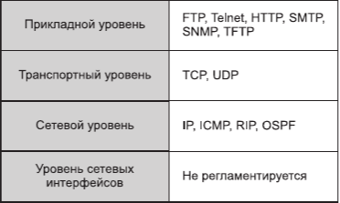

[Рис. 13.1 — Иерархическая структура стека TCP/IP]

#### Ключевые особенности:
```
Прикладной уровень — службы для пользовательских приложений

Транспортный уровень — TCP (надёжная доставка) и UDP (быстрая, "по возможности")

Сетевой уровень — протокол IP (основной, работает на всех маршрутизаторах)

Уровень сетевых интерфейсов — инкапсуляция IP-пакетов в кадры любой технологии
```

### 13.2. Формат IP-адреса

IP-адрес — 32-битное число, записываемое как четыре десятичных числа, разделённых точками.

```
Пример: 129.64.134.5

В двоичном виде: 10000001 01000000 10000110 00000101
В шестнадцатеричном: 80.0A.02.1D
```

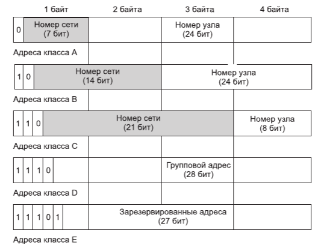

[Рис. 13.3 — Классы IP-адресов]

#### Структура адреса: состоит из номера сети и номера узла.

#### Классовая адресация (устаревшая, но важная для понимания):


|Класс	Первые биты|	Диапазон|	Число сетей|	Узлов в сети|
|------------------|------------|--------------|----------------|
|A|	0|	1.0.0.0 — 126.0.0.0	126|	16 млн|
|B|	10|	128.0.0.0 — 191.255.0.0|	16 384|	65 536|
|C|	110|	192.0.0.0 — 223.255.255.0|	2 млн|	254|
|D|	1110|	224.0.0.0 — 239.255.255.255|	—|	групповые|
|E|11110|	240.0.0.0 — 247.255.255.255|	—|	зарезервированы|

### 13.3. Особые IP-адреса

|Адрес	|Назначение|
|-------|----------|
|0.0.0.0|	Неопределённый адрес (собственный узел)|
|127.0.0.0|	Адрес обратной петли (loopback)|
|255.255.255.255|	Ограниченный широковещательный|
|<сеть>.255|	Широковещательный для сети|

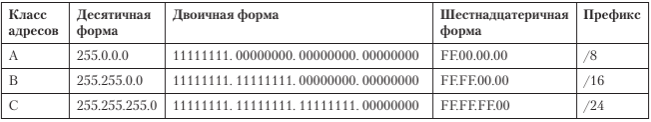

[Рис. 13.2 — Формат IP-адресов разных классов]

### 13.4. Маски подсети и CIDR

```
Маска — число, где единицы = номер сети, нули = номер узла

Пример: IP = 129.64.134.5, маска = 255.255.128.0

Наложение маски:
129.64.134.5 & 255.255.128.0 = 129.64.128.0 — это номер сети
```

#### Префиксная запись: 192.168.1.0/24 — маска длиной 24 бита (255.255.255.0).

#### Частные адреса (для внутреннего использования):
```
10.0.0.0/8

172.16.0.0/12

192.168.0.0/16
```

### 13.5. Протокол ARP (Address Resolution Protocol)

#### Проблема: Есть IP-адрес, нужен MAC-адрес для передачи кадра Ethernet.

#### Решение: Широковещательный запрос ARP.

```
┌─────────────────────────────────────────────────────────┐
│  Кто имеет IP-адрес 194.85.135.65? Сообщи свой MAC!    │
└─────────────────────────────────────────────────────────┘
                           ↓
              ┌────────────────────────┐
              │  У меня IP=194.85.135.65│
              │  Мой MAC=00E0F77F1920  │
              └────────────────────────┘
```

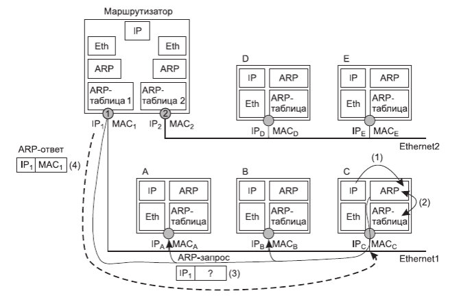

[Рис. 13.5 — Схема работы протокола ARP]


#### ARP-таблица (кэш):

|IP-адрес	|MAC-адрес	|Тип|
|-----------|-----------|---|
|194.85.135.65|	00E0F77F1920|	динамический|
|194.85.135.75|	008048EB7E60|	динамический|
|194.85.60.21|	008048EB7567|	статический|

### 13.6. Система DNS (Domain Name System) 

#### Назначение: Преобразование символьных имён (www.example.com) в IP-адреса.

#### Иерархическая структура имён:

```
                    корень (.)
                      │
              ┌───────┴───────┐
              │      ru       │
              └───────┬───────┘
                  ┌───┴───┐
              ┌───┴───┐   │
              │ mmt.ru│   │ ...
              └───┬───┘
              ┌───┴───┐
              │zil.mmt│
              └───┬───┘
              ┌───┴───┐
          ┌───┴───┐   │
          │www.zil│   │...
          └───────┘
```

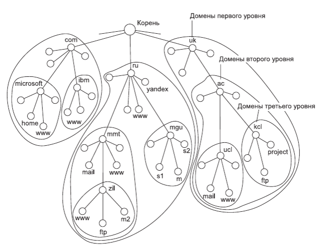

[Рис. 13.8 — Пространство доменных имён]

#### Типы записей DNS:
```
A — имя → IPv4-адрес

AAAA — имя → IPv6-адрес

NS — DNS-сервер домена

MX — почтовый сервер
```

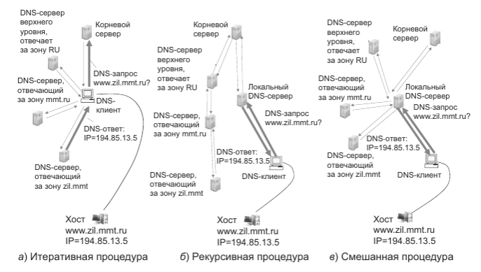

[Рис. 13.9 — Итеративная и рекурсивная процедуры разрешения имён]

### 13.7. Протокол DHCP (Dynamic Host Configuration Protocol)

#### Назначение: Автоматическая выдача IP-адресов и параметров конфигурации.

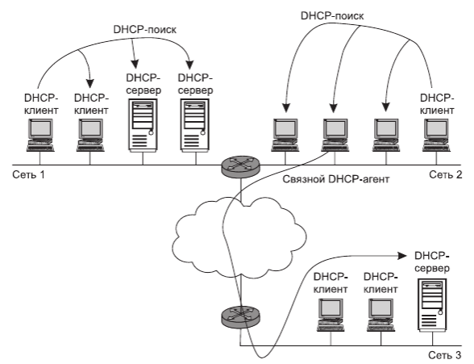

[Рис. 13.11 — Схемы взаимного расположения DHCP-серверов и клиентов]

#### Режимы работы:
```
Ручное назначение — жёсткая привязка MAC → IP

Автоматическое статическое — адрес закрепляется за клиентом при первом запросе

Динамическое — адрес выдаётся на ограниченный срок (аренда)
```

#### Процесс получения адреса:
```
Клиент → широковещательный DHCP Discover

Сервер(ы) → DHCP Offer (предложение адреса)

Клиент → DHCP Request (выбор предложения)

Сервер → DHCP Acknowledge (подтверждение)
```

## Глава 14

### 14.1. Структура IP-пакета (IPv4)

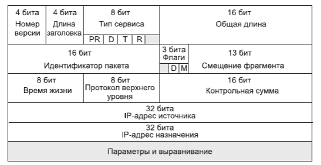

[Рис. 14.1 — Структура заголовка IP-пакета]

#### Основные поля заголовка IP (20 байт + опции):

|Поле|	Размер|	Назначение|
|----|--------|-----------|
|Version	|4 бита	|Версия протокола (4 для IPv4)|
|IHL	|4 бита|	Длина заголовка в 32-битных словах|
|Type of Service|	8 бит|	Приоритет, QoS|
|Total Length|	16 бит	|Длина всего пакета (заголовок + данные)|
|Identification|	16 бит	|ID для фрагментации|
|Flags|	3 бита	|DF (не фрагментировать), MF (ещё фрагменты)|
|Fragment Offset|	13 бит|	Смещение фрагмента (в 8-байтных единицах)|
|TTL|	8 бит|	Время жизни (макс. число хопов)|
|Protocol|	8 бит|	Протокол верхнего уровня (6=TCP, 17=UDP)|
|Header Checksum|	16 бит|	Контрольная сумма заголовка|
|Source Address|	32 бита|	IP-адрес отправителя|
|Destination Address|	32 бита|	IP-адрес получателя|

### 14.2. Принцип IP-маршрутизации

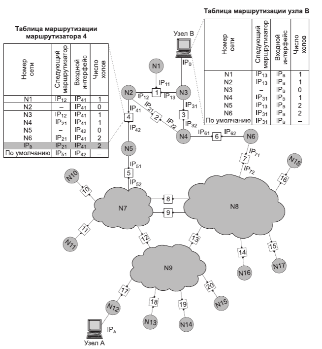

[Рис. 14.2 — Принципы маршрутизации в составной сети]

#### Таблица маршрутизации (упрощённая):


|Адрес назначения	|Следующий маршрутизатор|	Выходной порт|	Расстояние|
|-------------------|-----------------------|----------------|------------|
|N1|	IP12 (R1)|	IP41	|1|
|N2	|—	|IP41	|0 (подключена)|
|N3	|IP12 (R1)|	IP41	|1|
|N6	|IP21 (R2)|	IP21	|2|
|маршрут по умолчанию|	IP51 (R5)|	IP42|	—|


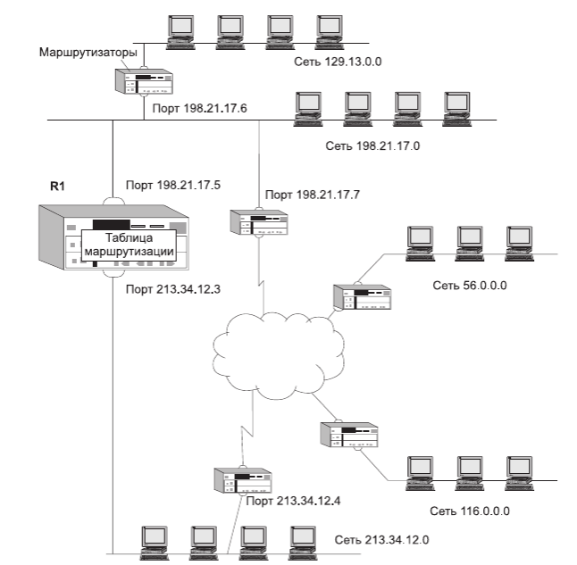

[Рис. 14.3 — Пример маршрутизируемой сети]

#### Алгоритм работы маршрутизатора:
```
Извлекает IP-адрес назначения из пакета

Ищет специфический маршрут (к конкретному хосту)

Если нет — ищет маршрут к сети (по номеру сети)

Если нет — использует маршрут по умолчанию

Если нет и этого — отбрасывает пакет
```

### 14.3. Маршрутизация с использованием масок

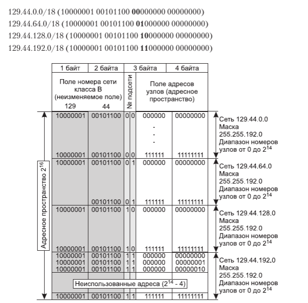

[Рис. 14.9 — Разделение адресного пространства сети класса В на равные части]

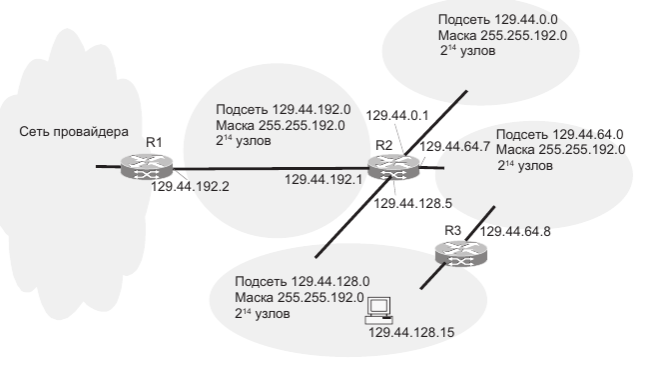

[Рис. 14.10 — Маршрутизация с использованием масок одинаковой длины]

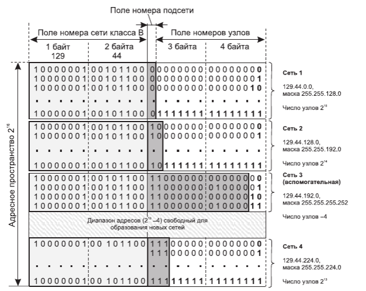

[Рис. 14.11 — Разделение адресного пространства масками переменной длины]

### Алгоритм поиска с масками:
```
Для каждой записи в таблице накладываем маску на IP-адрес пакета

Сравниваем результат с адресом сети в записи

Выбираем запись с самой длинной маской (наиболее специфичный маршрут)
```

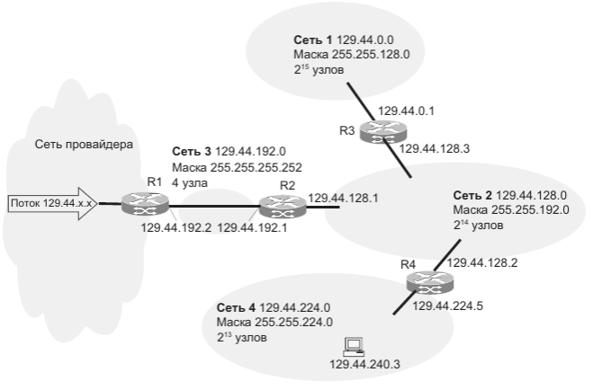

[Рис. 14.12 — Структуризация сети масками переменной длины]

### 14.4. Фрагментация IP-пакетов

#### Проблема: Размер IP-пакета может превышать MTU (Maximum Transmission Unit) следующей сети.

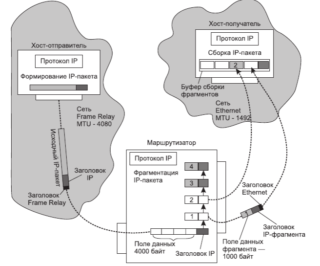

[Рис. 14.13 — Фрагментация в составной сети]

#### Параметры фрагментации:
```
Identification — одинаковый для всех фрагментов одного пакета

MF (More Fragments) = 1 для всех, кроме последнего

Fragment Offset — смещение данных фрагмента в исходном пакете (кратно 8 байтам)

DF (Don't Fragment) = 1 — запрет фрагментации
```

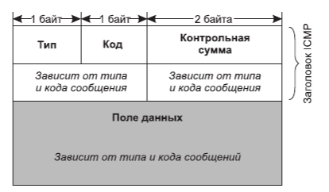

[Рис. 14.14 — Формат ICMP-сообщения]

### 14.5. Протокол ICMP (Internet Control Message Protocol)

#### Назначение: Передача диагностических сообщений и уведомлений об ошибках.

#### Основные типы ICMP-сообщений:

|Тип|	Название|	Назначение|
|---|-----------|-------------|
|0	|Echo Reply	|Ответ на ping|
|3	|Destination |Unreachable	|Узел/порт/сеть недоступны|
|8	|Echo Request|	Ping-запрос|
|11	|Time Exceeded|	Истекло время жизни (TTL=0)|

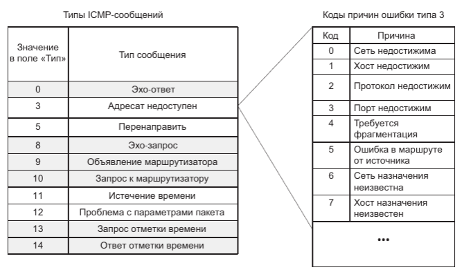

[Рис. 14.15 — Типы ICMP-сообщений и коды причин]

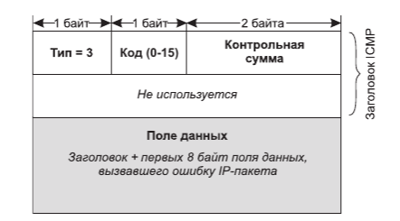

[Рис. 14.16 — Формат ICMP-сообщения об ошибке]

### 14.6. Утилиты ping и traceroute

#### Ping — проверка доступности узла:

```
# ping google.com
Reply from 142.250.185.46: bytes=64 time=15ms TTL=115
Reply from 142.250.185.46: bytes=64 time=14ms TTL=115
```

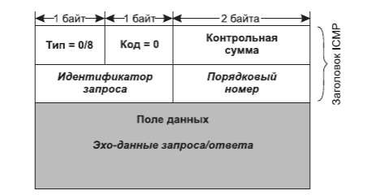

[Рис. 14.17 — Формат ICMP-сообщений эхо-запрос/эхо-ответ]

### Принцип работы traceroute:
```
Посылает пакет с TTL=1 — первый маршрутизатор отбрасывает, сообщает о себе

Посылает пакет с TTL=2 — второй маршрутизатор отбрасывает, сообщает о себе

И так далее, пока не достигнет узла назначения
```

## Ключевые выводы по главам 13-14

|Вопрос|	Ответ|
|------|---------|
|Как узлы находят друг друга по IP?|	ARP → MAC-адрес|
|Как имена преобразуются в IP?|	DNS (иерархическая система)|
|Как устройства получают IP автоматически?|	DHCP (аренда адресов)|
|Из чего состоит IP-пакет?|	Заголовок (20 байт) + данные|
|Как маршрутизаторы выбирают путь?|	Таблица маршрутизации + маски|
|Что делать, если пакет слишком большой?|	Фрагментация (или отброс, если DF=1)|
|Как диагностировать проблемы сети?|	ICMP (ping, traceroute)|